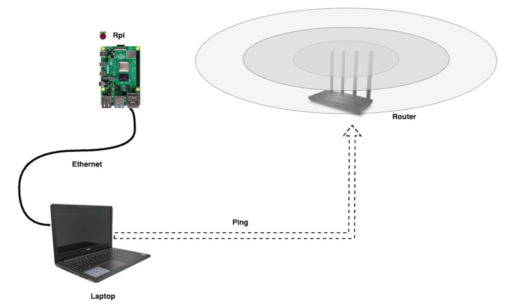

# 🎓 A Deep Learning Based Human Activity Recognition Using Wi-Fi Signals
#### Major Project :

This project uses a Raspberry Pi and Wi-Fi router to collect Channel State Information (CSI) data, which tracks changes in Wi-Fi signals caused by human movements, to train a model that recognizes different human activities.

|   |
|:---------------------------------------------:|

## Demo Video 
This [Demo](https://youtube.com/shorts/i1IyGovJwDo?si=px6QW7QejZuBewC6) was recorded in closed environments with only one person in the Wi-Fi range. 

## Project Workflow

- **Hardware**: Setup Hardware components, Raspberry Pi(Rx) and Router(Tx) with UI code for data collection.

- **Data Collection**: Collecting CSI data with application of filters (preprocessing techniques) in real-time using UI.

- **Visualization**: Visualizing the CSI data and applying [v1.0](https://github.com/xaxm007/WiFi-CSI-HAR/tree/sxt2) preprocessing for verification.

- **Model Training**: Building model architecture and training the model to recognize different human activities.

---

## Repository Structure

<!-- - [Documents](./Documents/): Project Report & Presentation. -->

- [Implementation](./Implementation/): Source Code and Usage Instruction.

- [Reference Papers](./Reference%20Papers/): Researches Highly Relevant to our work.

- [SXT2](https://github.com/xaxm007/WiFi-CSI-HAR/tree/sxt2): v1.0 of this repository using MikroTik SXT2 router and python GUI Implementation with different preprocessing techniques and PyTorch model training.
